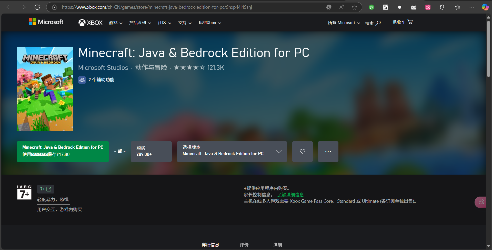

<!-- 说实话这个没啥技术含量,随便用吧 -->

# [我的世界](https://minecraft.net "我的世界官网")教程
## 这是一个从0开始的我的世界教程.
##### (由[MinecraftWiki](https://zh.minecraft.wiki/)改编而来)
-------------------------

### 须知
**你需要知道的**: 
我的世界分为多个版本: 有Java版、基岩版、原主机版等
本教程主要教学的是**Java版(不包括网易代理的版本)**,所以你最好拥有一个电脑.

Java版 (JavaEdition,简称JE) 是最早开发的版本,支持Windows、MacOS、Linux发行版和BSD操作系统,俗称“电脑版”或“PC版”.
截止2025年4月,Java版的最新版是1.21.5,常用版本有1.7.10、1.8.9、1.12.2、1.16.5、1.20.1等.

**下载**、**安装**、**启动Java版Minecraft(包括从整合包安装)时**,**务必弄清楚Java版Minecraft的具体版本**.Minecraft的很多功能以及译名都是因版本而异的.你可以从启动器、Minecraft窗口的标题栏、主菜单或调试屏幕了解其版本.

Java版无论是哪个版本,都要通过启动器启动；目前社区中有多种启动器,包括官方的和非官方的.

无论是在Windows系统、macOS系统、Linux发行版还是在BSD上,**Java版的Minecraft必须安装Oracle Java(或OpenJDK)才能运行**.官方启动器会自动下载合适版本的Java,而第三方启动器大多需要玩家自行安装Java：

- 对于多数游戏版本,官方推荐的Java版本是Oracle Java 1.8.0_51(Java 8),其可以直接在[Java官网](https://java.com/download/manual.jsp "Java官网下载")下载.
     -  其中,1.12(17w13a) - 1.16.5(1.17：21w18a)的游戏版本必须使用Java 8或更高版本运行.
- 对于1.17(21w19a) - 1.17.1(1.18：1.18-pre1)的游戏版本,其必须使用Java 16或更高版本才能运行.官方推荐的Java版本是Java 16.0.1,可以从Oracle官网的对应页面上下载.
- 对于1.18(1.18-pre2) - 1.20.4(1.20.5：24w13a)的游戏版本,其必须使用Java 17或更高版本才能运行.
- 对于1.20.5(24w14a)及以上的游戏版本,其必须使用Java 21或更高版本才能运行.
- 从1.6.1(13w16a)开始,Java版也可以使用Java 9及以上版本运行.

### 下载我的世界启动器

#### 启动器是什么
Java版游戏的几乎所有必需的文件都是从启动器下载的,启动游戏也往往需要启动器.

#### 官方启动器
官方启动器由官方发布.你可以从[Minecraft官网](https://minecraft.net/download "下载我的世界官方启动器")下载官方的启动器.

官方启动器能够自动下载运行环境.对于1.17版本的游戏,可以自动下载Java 16；对于1.18版本的游戏,可以自动下载Java 17.

官方启动器需要登录才可以启动游戏，而且需要购买才能够使用完整版，否则为有游戏时间限制的演示版。官方启动器能够提供游戏资源下载等功能。

部分非官方启动器不需要购买就可以启动完整版的游戏（实际上它们可以通过Java命令行参数启动），其中的大部分非官方启动器也提供了游戏资源.

#### 非官方启动器(即第三方启动器)

第三方启动器是指非官方的、由社区或个人开发维护的启动器,如[HMCL](https://hmcl.huangyuhui.net/)、[MultiMC](https://multimc.org/)、[PCL2](https://afdian.com/p/0164034c016c11ebafcb52540025c377)、[BakaXL](https://www.bakaxl.com/)等,但第三方启动器不一定安全,请谨慎使用.

通常来说,第三方启动器有以下优点：

- 同时支持离线模式或正版登录,因此未拥有游戏的玩家也可以通过离线登录的方式下载并进入游戏.
- 可以更加便捷地安装Forge、OptiFine、Fabric、LiteLoader等加载器.
- 自定义启动位置,或从官方启动器的启动位置启动.
- 支持通过下载源（如[BMCLAPI](https://bmclapidoc.bangbang93.com/)）或官方渠道下载游戏文件.得益于此,玩家可以根据自身网络情况使用更快的下载源.

#### 购买我的世界
[我的世界官方网站](https://www.minecraft.net/store/minecraft-java-bedrock-edition-pc "官方购买渠道")与[Xbox商店](https://www.xbox.com/games/store/minecraft-java-bedrock-edition-for-pc/9nxp44l49shj "官方购买渠道")是购买Java版的**唯一**正规渠道,目前与Windows基岩版捆绑销售.

自2020年12月1日起,购买和游玩Java版需要拥有微软账户,并使用支持微软账户登录的启动器,已使用Mojang账户购买游戏的玩家会陆续开放转移账户通道.

账户转移在2023年9月19日停止,在截止日期前仍未转移的账户将无法登录.

你需要使用微软账户才能购买游戏,如果卡在登录界面,请检查一下网络情况.

**Minecraft的官方网站无法使用人民币进行购买,如果使用港币等其他币种价格将会高出很多.建议从Microsoft Store或Xbox商店购买.**

购买之后,请保存好Mojang Studio向你发送的电子邮件.因为这个电子邮件是你购买Minecraft的**最直接、有效**的**凭据**.请你务必保存好它,以便在你的账户被盗取之后帮助你证明自己的**购买者**身份.

#### 区分正规Minecraft

正规的Minecraft（允许包含Mod和Forge等，不一定是正版）应该有以下特征，否则这个游戏是被修改过的，或者不是Java版。

- Minecraft必须用启动器启动（不一定是官方启动器）。如果你一点开就可以进入游戏，这通常是假的Minecraft。但是，启动器一般具有一键启动游戏的功能。比如，有的启动器可以生成启动脚本（批处理文件或快捷方式，即bat、cmd或lnk格式），打开这些文件后即可立即启动游戏。
    - 注意：从非正规渠道可以下载到正规Minecraft，但是部分非正规渠道会通过非官方的安装程序进行安装，诚然，这种安装程序通常是有效的，但是有可能夹杂恶意软件；另外，有可能安装之后会先启动一个由第三方提供的所谓“启动器”（通常携带广告等）。你需要通过“启动器”启动真正的启动器，再启动游戏，而这通常是不推荐的。如果遇上这种情况，一般可以从安装位置直接找到真正的启动器。
- 官方启动器需要登录才可以启动游戏，而且需要购买才能够使用完整版，否则为有游戏时间限制的演示版。官方启动器能够提供游戏资源下载等功能。部分非官方启动器不需要购买就可以启动完整版的游戏（实际上它们可以通过Java命令行参数启动），其中的大部分非官方启动器也提供了游戏资源（包括游戏主文件、OptiFine、Forge、Neoforge、Fabric、Quilt、LiteLoader、Rift、资源文件（assets）、标准库（libraries））下载和安装的功能。在中国大陆地区，有时候下载会非常慢或者根本无法下载，此时可以尝试使用间接方式下载，比如有的非官方启动器具有通过BMCLAPI下载的功能，这种方式有时会快一些，但是游戏版本更新稍慢。另外，大多数非官方启动器的“自动安装Forge”等功能借助了BMCLAPI的服务器。注意：有时候从官方下载可能比通过BMCLAPI下载速度更快。
- Minecraft从来没有广告（但是非官方启动器可能有）。值得注意的是，有些Mod或许会在游戏中加入广告。
- Minecraft需要Java启动。官方启动器及多数第三方启动器可以不需要额外安装Java也可以启动。默认的Java安装地址为系统盘:\Program Files（或Program Files (x86)）\Java\版本\bin\javaw.exe或/usr/bin/java。级别较高的系统可能需要64位的Java（在Linux系统上，还要注意处理器的具体架构，如x86_64与arm64）。官方启动器运行时，会自动检测并下载Java（即runtime），有可能在与启动器同一个文件夹中的runtime文件夹下。其他的启动器大多没有此功能，但是也可以以官方启动器下载的runtime中的..\bin\javaw.exe启动游戏。参见§ 正确地安装及配置Java以及可能遇见的显卡问题段落。
    - 目前最新版官方启动器不需要额外安装Java也可以启动，但如果要使用Mod时仍可能需要额外安装的Java[需要验证]。部分非官方的启动器需要手动下载Java才能启动。
    - 启动游戏需要的最低Java版本如下：
        - Java版1.12（17w13a）以前的版本为Java 6。
        - Java版1.12（17w13a）到Java版1.16.5（21w18a）的版本为Java 8。
        - Java版1.17（21w19a）到Java版1.17.1（1.18-pre1）的版本为Java 16。
        - Java版1.18（1.18-pre2）到Java版1.20.4（24w13a）的版本为Java 17。
        - Java版1.20.5（24w14a）及以后的版本为Java 21。
- Minecraft的配置文件（包括资源文件、资源包、地图、设置）存储在\.minecraft\文件夹中（Mac则位于\minecraft\，Linux则位于~/.minecraft）。启动器可以修改。
    - 非官方启动器通常将Minecraft的位置设为启动器所在文件夹\.minecraft，但也可以修改。
- 原版Minecraft不会使用系统安装的字体，而是自带字体，如果将语言设为某些特定的语言（如中文，仅限Java版1.13前）或者开启“强制使用Unicode字体”设置则不会。Minecraft里面的中文为GNU Unifont。
    - 有些Mod可以使它显示系统的字体。资源包也可以自定义游戏的字体。
- Minecraft的正式版版本是1.X(.X)的格式，除了愚人节玩笑（如Java版2.0）外。没有类似3.3.14.2一类的版本。正式版最多有2个点（如1.18.1），不过开发版本例外（如15w32c）（详见版本格式 § Java版）。游戏版本可以在主界面左下角看到，也可以在标题栏看到。在Java版1.9之后版本的选择世界界面中会显示这个世界的版本名。
    - 请不要混淆Minecraft版本、启动器版本、Forge/Fabric/Rift版本和各种Mod的版本。例如，游戏版本可能是1.15.2或1.6（注意游戏版本不能直接作为小数处理，1.12是比1.6新的版本，Beta 1.8是1.0之前的版本），启动器版本可能是3.12.30，OptiFine的版本可能是HD U C8，Forge的版本可能是14.23.1.2587。
    - 由于未知原因，部分愚人节玩笑版本无法在某些装有macOS或Linux系统的设备上启动，而其他版本正常。这可能是驱动问题或图形函数库的问题导致的。
- 原版Minecraft游戏内不会将“Minecraft”显示为“我的世界”。
- 原版Minecraft可能会将标题“Minecraft”显示为“Minceraft”。
- 在21w10a或更高版本，Minecraft需要显卡支持OpenGL3.2。

#### 登录Minecraft
登录游戏需要拥有购买过Minecraft的账号。登录之后，你可以使用自定义皮肤，并加入多人游戏和Realms。

对于部分非官方启动器，启动Minecraft可以在正版验证中选择“离线”等字样，此时你不需要登录就可以进入游戏，但仍需指定一个用户名。

#### 启动Minecraft
大多数情况下,你只需要按下标有"Launch"或者"启动"字样的按钮即可启动我的世界，但是你需要等待片刻以使我的世界初始化。

#### 欢迎来到主菜单

主菜单是你在进入游戏时就会看到的界面。主菜单的背景是游戏世界的全景。Minecraft的版本在左下角，而在游戏标题右下方会显示闪烁标语。主菜单为你提供了选择游戏类型以及进入Minecraft Realms界面的按钮，还有游戏选项和一个退出游戏的按钮。

| 按钮 | 行为 |
|-------------|----------------------------------|
| 单人游戏 | 进入单人游戏界面 |
| 多人游戏 | 进入多人游戏界面 |
| Minecraft Realms | 进入Minecraft Realms界面 |
| 地球图标   | 进入游戏语言界面 |
| 选项... | 进入选项界面 |
| 退出游戏 | 关闭游戏 |
| 小人图标 | 进入辅助功能设置界面 |

## 现在你已经成功成为了一名我的世界玩家!开始冒险吧!

---

### 下方的一些链接可能对你有所帮助:

[我的世界维基百科:教程页面](https://zh.minecraft.wiki/w/%E6%95%99%E7%A8%8B)
[Bilibili:我的世界](https://search.bilibili.com/all?keyword=%E6%88%91%E7%9A%84%E4%B8%96%E7%95%8C)
[MCMOD百科](https://www.mcmod.cn/)
[编者的我的世界QQ交流群](https://qm.qq.com/q/an73e8X7Wg)

-------------------------
> Made By HighPing. ---2025/4/18